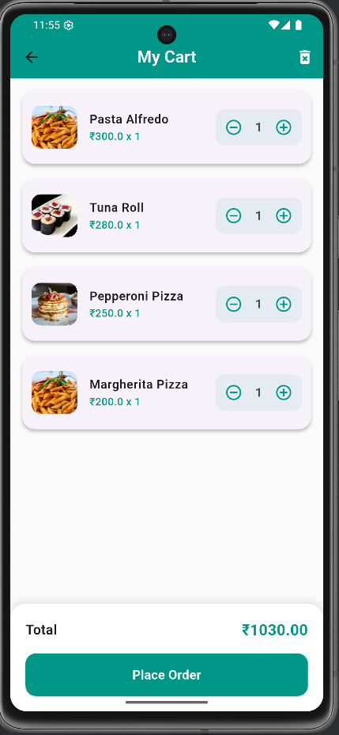

# Food Ordering App (Flutter)

A modern, aesthetically pleasing **Food Ordering App** built using **Flutter** and **Bloc pattern**. This app allows users to browse restaurants, view menus, add items to a cart, and place orders.

---

## 📸 Screenshot





---

## 🛠 Features

- Browse restaurants in a **grid view with images**.
- View menus of selected restaurants.
- Add menu items to a **cart** with quantity management.
- **Order summary** with total calculation.
- **Dynamic cart management**: Increase or decrease item quantity.
- **Place orders** with a confirmation dialog.
- **Modern, responsive UI** using Flutter widgets.
- **Bloc pattern** for state management (`CartBloc`, `MenuBloc`, `RestaurantBloc`).

---

## 💻 Getting Started

### Prerequisites

- [Flutter](https://flutter.dev/docs/get-started/install) installed (Flutter 3+ recommended)
- Dart SDK
- Android Studio / VS Code
- A connected device or emulator

### Installation Steps

1. **Clone the repository:**
```bash
git clone <your-repo-url>
cd delivery_app
